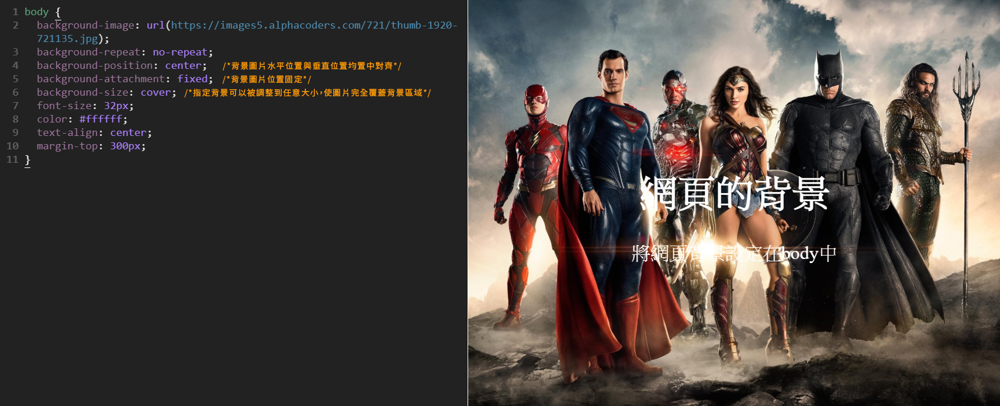

# 背景設定

background背景如果將CSS下在&lt;body&gt;上，預設會主動填滿背景，如是使用照片做背景也會不斷重複直到填滿背景，除非有下 `no-repeat` 圖片就不會重複填滿。

### 填滿背景色


```css
background-color: orange;
```

### 填滿漸層色


```css
background: radial-gradient(yellow, red);
```

### 

### 圖片當背景


```css
 background: url("../images/superwoman.jpg") no-repeat;
```

### 填滿圖片背景


```css
background-image: url("../images/hart.jpg");
```

### 文字壓在背景上


## 使整張圖片不重複



背景從手機畫面呈現，會維持原始比例。


