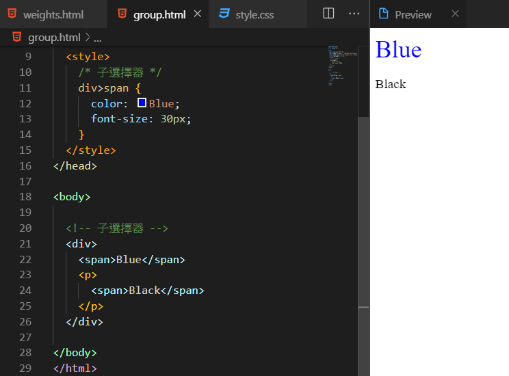

# CSS基本選擇器\(一\)


### 選擇器\(Selector\)：

CSS選擇器最常用的幾種如下

選擇器\(Selector\)：是一種模式，用於選擇你要添加的HTML 樣式元素。種類分成以下幾種

### Class \(類別選擇器\)

Class，「類別」選擇器，使用「.」開頭，Class名稱可自訂，一個class屬性值可以用在多個網頁上，**名稱大小寫也代表不一樣的Class**。

Class宣告的方法:  .Class屬性名稱

```css
/**Class選擇器**/
.TitleBanner{
width:100%;
height:50%;
background-color:#fd7676;
}
```

```markup
<!--將以上樣式套用在 HTML 內-->
<div class="TitleBanner">此段會套用Class</div>
```

### ID 選擇器

ID 選擇器，使用「\#」開頭，Class名稱也可以自訂，但一個ID名稱，只能在一個網頁文件上**使用一次**。且ID命名**不能有空格，名稱大小寫也代表不一樣的ID**。

_ID宣告的方法: \# id名稱_

```markup
#TitleBanner 和 #tablebanner 兩個名稱代表不同ID
```

```css
/**ID選擇器，**/
#TitleBanner{
width:100%;
height:50%;
background-color:#fd7676;
}
```

```markup
<!--將以上樣式套用在 HTML 內-->
<div id="TitleBanner">此段會套用Class</div>
```

### element selector\(元素選擇器\)

設定在HTML的屬性標籤上，一旦設定，全站往網頁都會套用。

```css
h1 {color:red;}
p {color:black;font-size:25px;}
```

### Universal selector（通用選擇器）

使用字元「**\***」，整個網頁下的所有元素都會套用，基本上用在reset css才會使用。

```css
* {color:red;}
```

### Group selectors（ **群組選擇器**）

```css
h1,h2,h3 { color: #f00909; }
```


###  Descendant selector**\(子孫選擇器**\)

元素間的親子關係，父元素→子元素→孫元素，中間必須要有半形的空格分隔出元素標籤。

```css
div h1 a{ color: Black; } 
```


### Child selector\(子元素選擇器\)

子選擇器只會選擇子元素，子元素的子元素或孫元素樣式不會受到影響。

```css
div>span {
   color: Blue;
   font-size: 30px;
}
```



###  Adjacent sibling selector\(**相鄰選擇器\)**

選擇相同一個父元素底下，同一層的相鄰兄弟，第一個相鄰的元素。

```css
.father {color: coral;}
div+p {color: #ff0000;}
```


