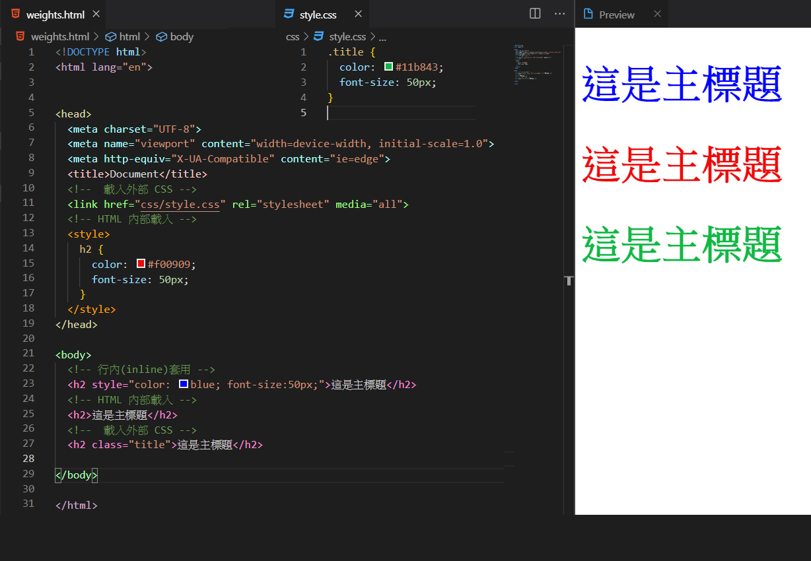
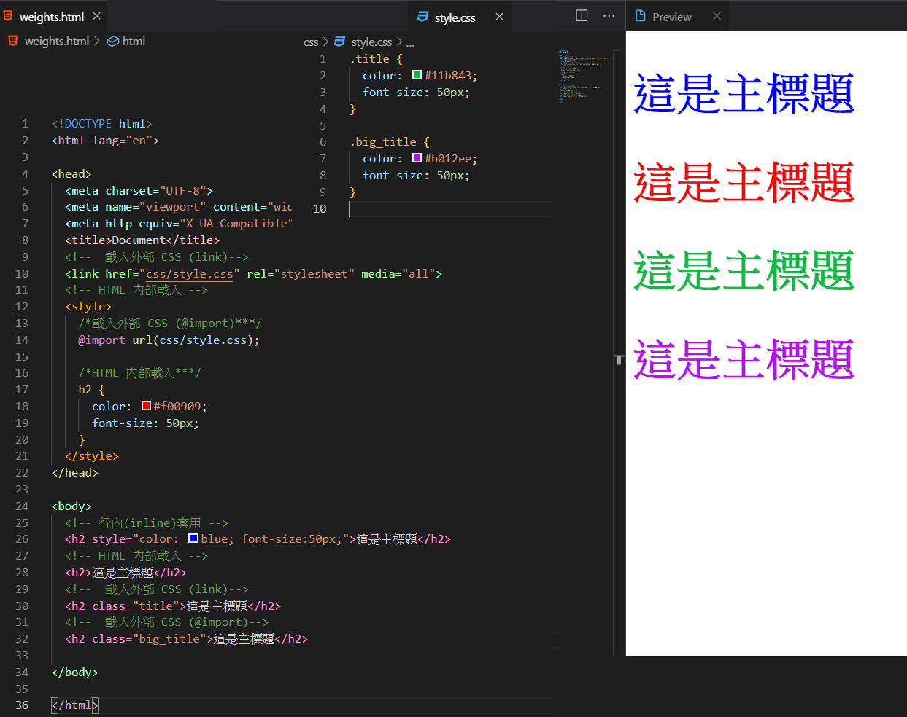
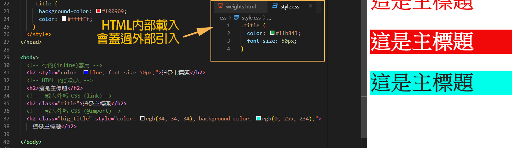

# CSS 套用方法

如何將CSS 套用進HTML 裡面?

#### 有以下4種方式:


###  **行內\(inline\)套用**

直接在 HTML 標籤中使用 style 屬性指定 CSS 樣式。

```markup
<h2 style="color: blue; font-size:50px;">這是主標題</h2>
```


這寫法很直覺，但如果HTML很多行，你每一行都都單獨設定CSS樣式，到時後要修改或是維護會很麻煩，所以不建議將CSS樣式寫在HTML行內裡。

###  **HTML 內部載入**

將CSS寫在HTML文件的頭部&lt;head&gt;元素中。

```markup
<head>
  <style>
    h2 {
      color: #f00909;
      font-size: 50px;
    }
  </style>
  </head>
```

```markup
<h2>這是主標題</h2>
```


將CSS寫在HTML的&lt;head&gt;中，雖然是有將CSS和HTML分開，但寫在單獨這一頁的CSS就只能給這一頁的HTML用而已，其他的HTML頁面無法共用，除非是這一頁獨有樣式，才會這樣寫，所以也不建議這種編寫方式。

### 載入外部 CSS

將CSS另外存成一個 .CSS檔案，並從HTML的&lt;head&gt;引入進來， 引入的方法有2種方式。

* **link 元素\(最常用\)**
* **＠import**

### 載入link

在html檔案中載入外部css檔

```markup
<head>
<link href=“style.css”rel=“stylesheet” media=“all”>
</head>
```

* **`href`** 屬性 – 指定外部CSS路徑
* **`rel`** 屬性 – 指定載入檔案的類型，stylesheet為固定載入CSS檔的屬性值
* **`media`** – 指定適用此CSS的媒體種類，如: screen、print、tv…等，all表示不限媒體


```css
.title {
  color: #11b843;
  font-size: 50px;
}
```

```markup
<head>
 <link href="css/style.css" rel="stylesheet" media="all">
</head>
<body>
<h2 class="title">這是主標題</h2>
</body>
```



### **＠import載入**

```css
.big_title {
  color: #b012ee;
  font-size: 50px;
}
```

```markup
<head>
<style>
    @import url(css/style.css);
</style>
</head>
<body>
<h2 class="big_title">這是主標題</h2>
</body>
```




在HTML 套用CSS，最常用的就是用link 引入，因為可以多個網頁共用同一個CSS，且檔案維護也比較容易。


> 以上這幾種CSS套用方式，也是有優先順序的權重問題
>
> ### **行內\(inline\) ＞ HTML內部載入 ＞ 外部載入CSS** <a id="3f1e"></a>

假如同一個元素有行內CSS 和 外部載入的CSS ，會先以行內的CSS設定為主


HTML內部載入會蓋過另外寫在外部的CSS



