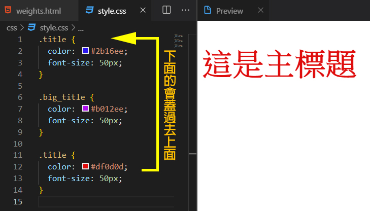
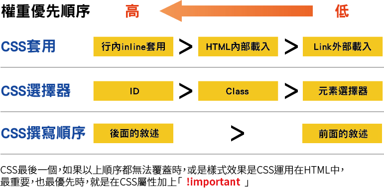

# CSS 權重關係

CSS選擇器最常見的有三種，元素選擇器\(element selector\)、類別選擇器（class selector）與ID選擇器（id selector）

### ID選擇器

ID選擇器是HTML網頁中，只能唯一被指定一次，並且不能重複命名使用的，權重也是三者中最高!  
ID選擇器可以被 Javascript 中的 GetElementByID 函數所運用。

### Class選擇器 

 class任何元素標籤都可以使用，可以在 HTML 文件中多處重複被使用，權重為第二高，Class 選擇器無法被 Javascript 運用。

### 元素選擇器

在網頁中常常出現，就像是&lt;p&gt;、&lt;h1&gt;...這些在CSS選擇器中都屬於在元素選擇器，也是所有權重最低的。


CSS **寫在後面的敘述，優先於寫在前面的敘述**


 CSS 的撰寫順序基本上是以**「寫在後面的敘述，優先於寫在前面的敘述」**為原則，只要後面衝突到同一個位置的值就會覆寫過去。

### CSS 優先順位

###  **!important**

 **!important會忽略所有的CSS，也是最高優先權**

